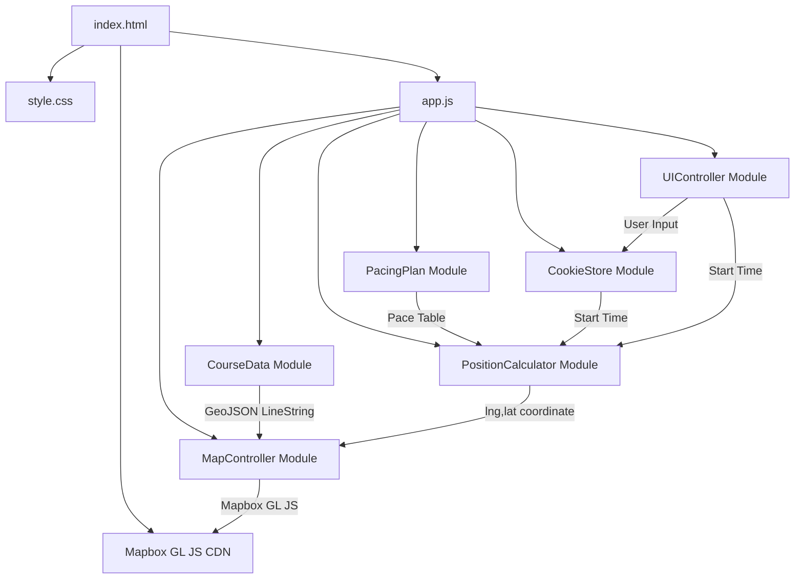
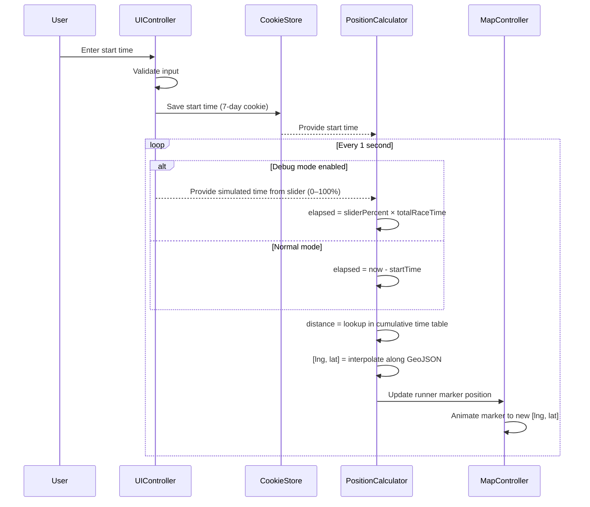

# Design Document: Marathon Live Tracker

## Overview

Marathon Live Tracker is a single-page web application built with vanilla HTML/CSS/JS and Mapbox GL JS. It renders the 2026 Boston Marathon course on a full-screen interactive map and simulates a runner's live position along the course in real time. The runner's geographic coordinate is computed entirely client-side by combining a pacing plan (miles-to-pace table), a user-provided start time, and the current wall-clock time. No backend server is required.

The core computation flow:

1. The pacing plan is converted into a cumulative time table (mile → elapsed minutes from start).
2. Each second, the app computes elapsed time since the start, looks up the corresponding distance in the cumulative time table, and linearly interpolates between mile markers to get a fractional distance.
3. That fractional distance is mapped onto the GeoJSON LineString geometry using linear interpolation along the polyline to produce a `[lng, lat]` coordinate.
4. The runner marker is animated to that coordinate on the Mapbox map.

## Architecture

The application follows a simple single-page architecture with no build step. All logic runs in the browser.



### Module Responsibilities

- **CourseData**: Exports the 2026 Boston Marathon GeoJSON LineString geometry.
- **PacingPlan**: Exports the miles-to-pace table and computes the cumulative time table.
- **PositionCalculator**: Given elapsed time, computes fractional distance along the course and interpolates the GeoJSON geometry to produce a `[lng, lat]` coordinate.
- **CookieStore**: Reads/writes the runner's start time to a browser cookie with 7-day expiration.
- **MapController**: Initializes Mapbox GL JS, renders the course polyline, manages the runner marker, handles style toggling.
- **UIController**: Manages the start time input UI, validation, the "Set Piotr Start Time" button, the hamburger menu, the debug mode toggle, and the time slider.

### Data Flow



## Components and Interfaces

### CourseData

The course geometry is derived from a GPX file (`course/gpx_20250421_id10253_race1_20250406001335.gpx`) exported from Garmin Connect. This GPX contains ~1,381 trackpoints with lat/lon/elevation data covering the full Boston Marathon route from Hopkinton to Boston.

At build time (task 2), a conversion script parses the GPX XML, extracts all `<trkpt>` lat/lon attributes, converts them to `[lng, lat]` pairs (GeoJSON order), and writes them as a static GeoJSON object embedded directly in `course-data.js`. This avoids any runtime XML parsing or external file loading.

```javascript
// course-data.js
// Exports the 2026 Boston Marathon route as a GeoJSON Feature
// Coordinates are pre-converted from: course/gpx_20250421_id10253_race1_20250406001335.gpx

/**
 * @returns {GeoJSON.Feature<GeoJSON.LineString>} The marathon course geometry
 *   with coordinates array of [lng, lat] pairs from Hopkinton to Boston.
 *   Approximately 1,381 coordinate pairs extracted from the GPX source.
 */
export function getCourseGeoJSON() { ... }

/**
 * Returns the total length of the course in miles (26.2).
 * @returns {number}
 */
export function getCourseLengthMiles() { ... }

/**
 * Returns the bounding box [west, south, east, north] for the course,
 * computed from the min/max lng/lat of all coordinates.
 * @returns {[number, number, number, number]}
 */
export function getCourseBounds() { ... }
```

### PacingPlan

```javascript
// pacing-plan.js

/**
 * @typedef {Object} PaceEntry
 * @property {number} mile - Mile marker (1 through 26, plus 26.2)
 * @property {number} paceMinPerMile - Pace in minutes per mile for this segment
 */

/**
 * Returns the pacing plan as an array of PaceEntry objects.
 * The last entry covers the final 0.2 miles.
 * @returns {PaceEntry[]}
 */
export function getPacingPlan() { ... }

/**
 * @typedef {Object} CumulativeEntry
 * @property {number} mile - Mile marker
 * @property {number} cumulativeMinutes - Total elapsed minutes from start to this mile
 */

/**
 * Computes the cumulative time table from the pacing plan.
 * Each entry maps a mile marker to the total elapsed time.
 * @param {PaceEntry[]} pacingPlan
 * @returns {CumulativeEntry[]}
 */
export function buildCumulativeTimeTable(pacingPlan) { ... }
```

### PositionCalculator

```javascript
// position-calculator.js

/**
 * Given elapsed minutes since start, returns the fractional distance
 * along the course in miles (0 to 26.2).
 * Clamps to [0, 26.2].
 * Uses linear interpolation between cumulative time table entries.
 *
 * @param {CumulativeEntry[]} cumulativeTable
 * @param {number} elapsedMinutes
 * @returns {number} Distance in miles along the course
 */
export function getDistanceAtTime(cumulativeTable, elapsedMinutes) { ... }

/**
 * Given a fractional distance in miles along the course, returns the
 * interpolated [lng, lat] coordinate on the GeoJSON LineString.
 *
 * Uses linear interpolation along the polyline segments, measuring
 * cumulative segment distances to find the correct position.
 *
 * @param {number[][]} coordinates - Array of [lng, lat] from the GeoJSON
 * @param {number} distanceMiles - Distance along the course in miles
 * @param {number} totalLengthMiles - Total course length (26.2)
 * @returns {[number, number]} [lng, lat]
 */
export function interpolatePosition(coordinates, distanceMiles, totalLengthMiles) { ... }
```

### CookieStore

```javascript
// cookie-store.js

/**
 * Reads the start time from the browser cookie.
 * @returns {Date|null} The stored start time, or null if not set.
 */
export function getStartTime() { ... }

/**
 * Saves the start time to a browser cookie with 7-day expiration.
 * @param {Date} startTime
 */
export function setStartTime(startTime) { ... }

/**
 * Removes the start time cookie.
 */
export function clearStartTime() { ... }
```

### MapController

```javascript
// map-controller.js

/**
 * Initializes the Mapbox GL JS map, fits to course bounds, draws the
 * course polyline, and creates the runner marker.
 *
 * @param {string} containerId - DOM element ID for the map
 * @param {GeoJSON.Feature} courseGeoJSON - The course geometry
 * @param {[number,number,number,number]} bounds - Course bounding box
 */
export function initMap(containerId, courseGeoJSON, bounds) { ... }

/**
 * Updates the runner marker position with smooth animation.
 * @param {[number, number]} lngLat - [lng, lat] coordinate
 */
export function updateRunnerPosition(lngLat) { ... }

/**
 * Toggles between vector and satellite map styles.
 * Preserves course polyline and runner marker after style change.
 */
export function toggleMapStyle() { ... }

/**
 * Returns the currently active style name ("vector" or "satellite").
 * @returns {string}
 */
export function getActiveStyle() { ... }
```

### UIController

```javascript
// ui-controller.js

/**
 * Initializes the UI: start time input, validation, hamburger menu,
 * debug mode toggle, time slider, and event listeners.
 * If no cookie exists, shows the start time prompt.
 * If a cookie exists, starts the simulation immediately.
 *
 * @param {Object} callbacks
 * @param {function(Date): void} callbacks.onStartTimeSet - Called when user sets a valid start time
 * @param {function(): void} callbacks.onToggleStyle - Called when user clicks the view toggle
 * @param {function(boolean): void} callbacks.onDebugModeChanged - Called when debug mode is toggled (true = enabled)
 * @param {function(number): void} callbacks.onSliderChanged - Called when the time slider value changes (0–100)
 */
export function initUI(callbacks) { ... }

/**
 * Returns whether debug mode is currently enabled.
 * @returns {boolean}
 */
export function isDebugMode() { ... }

/**
 * Returns the current time slider value (0–100).
 * @returns {number}
 */
export function getSliderValue() { ... }

/**
 * Validates a start time string input.
 * @param {string} value - The raw input value
 * @returns {{ valid: boolean, date: Date|null, error: string|null }}
 */
export function validateStartTime(value) { ... }

/**
 * Shows a validation error message on the start time input.
 * @param {string} message
 */
export function showError(message) { ... }

/**
 * Hides any visible validation error message.
 */
export function clearError() { ... }
```

### App Entry Point

```javascript
// app.js — orchestrates all modules

import { getCourseGeoJSON, getCourseBounds, getCourseLengthMiles } from './course-data.js';
import { getPacingPlan, buildCumulativeTimeTable } from './pacing-plan.js';
import { getDistanceAtTime, interpolatePosition } from './position-calculator.js';
import { getStartTime, setStartTime } from './cookie-store.js';
import { initMap, updateRunnerPosition, toggleMapStyle } from './map-controller.js';
import { initUI } from './ui-controller.js';

// 1. Build cumulative time table from pacing plan
// 2. Init map with course data
// 3. Init UI with callbacks (including onDebugModeChanged and onSliderChanged)
// 4. Start 1-second interval loop:
//    - If debug mode: elapsed = sliderPercent / 100 × total race time
//    - Else: elapsed = now - startTime
//    - Get distance from cumulative table
//    - Interpolate position on GeoJSON
//    - Update runner marker
```

## Data Models

### GeoJSON Course Data

The course is derived from a GPX file (`course/gpx_20250421_id10253_race1_20250406001335.gpx`) exported from Garmin Connect containing ~1,381 trackpoints. A one-time conversion script (Node.js) parses the GPX XML, extracts `lat`/`lon` attributes from each `<trkpt>`, and outputs them as `[longitude, latitude]` pairs embedded in `course-data.js`.

The resulting GeoJSON Feature has a LineString geometry ordered from Hopkinton (start) to Boston (finish):

```json
{
  "type": "Feature",
  "properties": {
    "name": "2026 Boston Marathon Course"
  },
  "geometry": {
    "type": "LineString",
    "coordinates": [
      [-71.518245, 42.22975],
      ...
      [-71.0766, 42.3496]
    ]
  }
}
```

The bounding box is computed from the min/max of all coordinates during conversion.

### Pacing Plan

An array of objects, one per mile segment. The final entry covers the 0.2-mile remainder.

```javascript
const pacingPlan = [
  { mile: 1,    paceMinPerMile: 8.5 },
  { mile: 2,    paceMinPerMile: 8.5 },
  // ... miles 3–25
  { mile: 26,   paceMinPerMile: 9.0 },
  { mile: 26.2, paceMinPerMile: 9.0 }  // final 0.2 miles → 0.2 * 9.0 = 1.8 min
];
```

### Cumulative Time Table

Derived from the pacing plan. Each entry stores the total elapsed minutes from the start to that mile marker.

```javascript
const cumulativeTable = [
  { mile: 0,    cumulativeMinutes: 0 },
  { mile: 1,    cumulativeMinutes: 8.5 },
  { mile: 2,    cumulativeMinutes: 17.0 },
  // ...
  { mile: 26,   cumulativeMinutes: 228.5 },
  { mile: 26.2, cumulativeMinutes: 230.3 }
];
```

### Cookie Format

The start time is stored as an ISO 8601 string in a cookie named `marathon_start_time`.

```
marathon_start_time=2026-04-20T10:30:00.000Z; expires=Mon, 27 Apr 2026 00:00:00 GMT; path=/; SameSite=Lax
```

### Application State

The app maintains minimal runtime state:

```javascript
const state = {
  startTime: Date | null,       // From cookie or user input
  cumulativeTable: [],           // Computed once from pacing plan
  courseCoordinates: [],          // From GeoJSON
  courseLengthMiles: 26.2,       // Constant
  currentStyle: 'vector',        // 'vector' | 'satellite'
  simulationInterval: null,      // setInterval ID
  debugMode: false,              // true when debug mode is active
  sliderPercent: 0               // 0–100, used only when debugMode is true
};
```

## Correctness Properties

*A property is a characteristic or behavior that should hold true across all valid executions of a system — essentially, a formal statement about what the system should do. Properties serve as the bridge between human-readable specifications and machine-verifiable correctness guarantees.*

### Property 1: Cumulative time table correctness

*For any* valid pacing plan (array of mile/pace entries), the cumulative time at mile N in the computed cumulative time table should equal the sum of `paceMinPerMile × segmentLength` for all segments from mile 0 to mile N. The first entry (mile 0) should always have cumulative time 0.

**Validates: Requirements 3.1**

### Property 2: Distance-at-time monotonicity and clamping

*For any* valid cumulative time table and *for any* two elapsed times `t1 < t2`, `getDistanceAtTime(table, t1) <= getDistanceAtTime(table, t2)` (monotonically non-decreasing). Additionally, *for any* negative elapsed time the result should be 0, and *for any* elapsed time greater than or equal to the finish time the result should be 26.2.

**Validates: Requirements 3.2, 3.3, 3.4**

### Property 3: Geographic interpolation lies on polyline

*For any* polyline (array of `[lng, lat]` coordinates with at least 2 points) and *for any* fractional distance between 0 and 1 (inclusive), the interpolated coordinate should lie on one of the line segments of the polyline. At fraction 0 the result should equal the first coordinate, and at fraction 1 the result should equal the last coordinate.

**Validates: Requirements 3.5**

### Property 4: Pacing plan structural validity

*For any* pacing plan returned by `getPacingPlan()`, it should contain exactly 27 entries. Each entry should have a `mile` property (numbers 1 through 26 plus 26.2) and a `paceMinPerMile` property that is a positive number. The mile values should be strictly increasing.

**Validates: Requirements 5.1, 5.2**

### Property 5: Cookie store round trip

*For any* valid `Date` object, calling `setStartTime(date)` followed by `getStartTime()` should return a `Date` whose time value (milliseconds since epoch) equals the original date's time value.

**Validates: Requirements 6.2**

### Property 6: Invalid start time rejection

*For any* string that is not a valid date/time representation (empty strings, random non-date text, whitespace-only strings), `validateStartTime(value)` should return `{ valid: false }` with a non-null error message.

**Validates: Requirements 6.6**

### Property 7: View toggle round trip

*For any* initial map style state, calling `toggleMapStyle()` twice should return the style to its original value. That is, `getActiveStyle()` before and after two toggles should be equal.

**Validates: Requirements 7.2**

### Property 8: Debug mode slider-to-elapsed-time mapping

*For any* slider value `p` in the range [0, 100] and *for any* valid cumulative time table with a total race time `T`, the simulated elapsed time should equal `p / 100 × T`. At slider value 0 the elapsed time should be 0, and at slider value 100 the elapsed time should equal `T`.

**Validates: Requirements 9.4, 9.5**

### Property 9: Debug mode toggle restores real-time behavior

*For any* application state where debug mode is enabled, disabling debug mode should cause the Position_Calculator to use the real wall-clock time. That is, after disabling debug mode, the computed elapsed time should equal `now - startTime` (within a 1-second tolerance), regardless of the previous slider position.

**Validates: Requirements 9.6, 9.7**